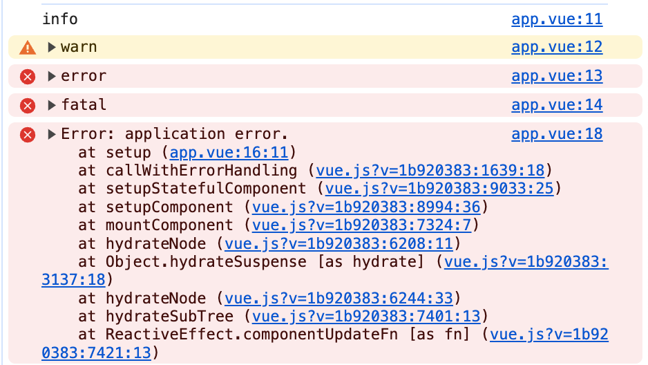
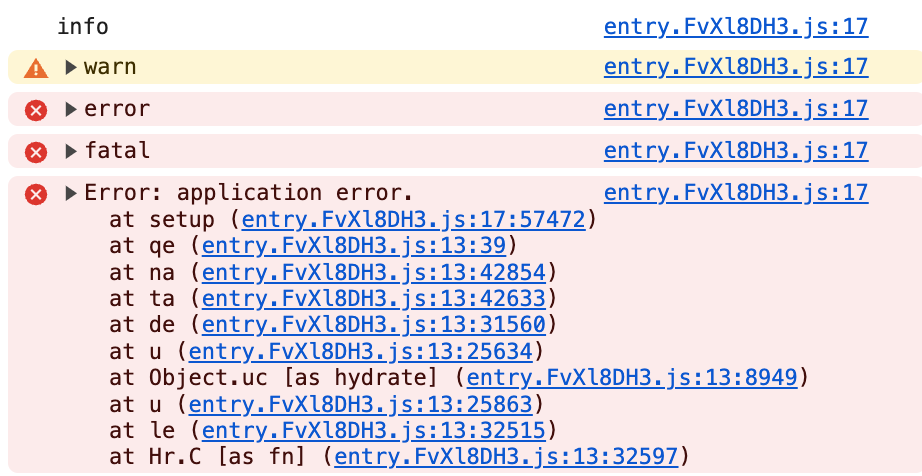

# Nuxt3 Logging

- Nuxt3 にロギングライブラリを導入する例。

## 📌 方針

- ロギングには高パフォーマンスが謳われている [pino](https://github.com/pinojs/pino) を使用する。
- ログフォーマットは動作環境によって変化させる。
- ローカル開発環境では可読性を重視し、アプリケーション運用環境では Cloud Logging と連携する為の構造化ロギング[^1] を行う。

## 📌 動作例

### 利用方法

```vue
<script lang="ts" setup>
  const { $logger } = useNuxtApp();
  $logger.trace('trace');
  $logger.debug('debug');
  $logger.info('info');
  $logger.warn('warn');
  $logger.error('error');
  $logger.fatal('fatal');
  try {
    throw new Error('application error.');
  } catch (e) {
    $logger.error(e);
  }
</script>
```

### ローカル開発環境

#### クライアント



#### サーバー

```
[xx:xx:xx.xxx] TRACE: trace
[xx:xx:xx.xxx] DEBUG: debug
[xx:xx:xx.xxx] INFO: info
[xx:xx:xx.xxx] WARN: warn
[xx:xx:xx.xxx] ERROR: error
[xx:xx:xx.xxx] FATAL: fatal
[xx:xx:xx.xxx] ERROR: application error.
    err: {
      "type": "Error",
      "message": "application error.",
      "stack":
          Error: application error.
              at setup (/xxxxxxxx/nuxt-logging-sample/app.vue:21:13)
              at _sfc_main.setup (/xxxxxxxx/nuxt-logging-sample/app.vue:40:23)
              at callWithErrorHandling (/xxxxxxxx/nuxt-logging-sample/node_modules/@vue/runtime-core/dist/runtime-core.cjs.js:193:18)
              at setupStatefulComponent (/xxxxxxxx/nuxt-logging-sample/node_modules/@vue/runtime-core/dist/runtime-core.cjs.js:7546:25)
              at setupComponent (/xxxxxxxx/nuxt-logging-sample/node_modules/@vue/runtime-core/dist/runtime-core.cjs.js:7507:36)
              at renderComponentVNode (/xxxxxxxx/nuxt-logging-sample/node_modules/@vue/server-renderer/dist/server-renderer.cjs.js:642:15)
```

### アプリケーション運用環境

#### クライアント



#### サーバー

```
{"severity":"INFO","time":"xxxx-xx-xxTxx:xx:xx.xxxZ","message":"info"}
{"severity":"WARNING","time":"xxxx-xx-xxTxx:xx:xx.xxxZ","message":"warn"}
{"severity":"ERROR","time":"xxxx-xx-xxTxx:xx:xx.xxxZ","message":"error"}
{"severity":"CRITICAL","time":"xxxx-xx-xxTxx:xx:xx.xxxZ","message":"fatal"}
{"severity":"ERROR","time":"xxxx-xx-xxTxx:xx:xx.xxxZ","stack_trace":"Error: application error.\n    at setup (file:///xxxxxxxx/nuxt-logging-sample/.output/server/chunks/app/server.mjs:858:13)\n    at _sfc_main$2.setup (file:///xxxxxxxx/nuxt-logging-sample/.output/server/chunks/app/server.mjs:871:25)\n    at callWithErrorHandling (/xxxxxxxx/nuxt-logging-sample/.output/server/node_modules/@vue/runtime-core/dist/runtime-core.cjs.prod.js:83:18)\n    at setupStatefulComponent (/xxxxxxxx/nuxt-logging-sample/.output/server/node_modules/@vue/runtime-core/dist/runtime-core.cjs.prod.js:6042:25)\n    at setupComponent (/xxxxxxxx/nuxt-logging-sample/.output/server/node_modules/@vue/runtime-core/dist/runtime-core.cjs.prod.js:6029:36)\n    at renderComponentVNode (/xxxxxxxx/nuxt-logging-sample/.output/server/node_modules/@vue/server-renderer/dist/server-renderer.cjs.prod.js:365:15)\n    at ssrRenderComponent (/xxxxxxxx/nuxt-logging-sample/.output/server/node_modules/@vue/server-renderer/dist/server-renderer.cjs.prod.js:91:10)\n    at default (file:///xxxxxxxx/nuxt-logging-sample/.output/server/chunks/app/server.mjs:940:19)\n    at ssrRenderSuspense (/xxxxxxxx/nuxt-logging-sample/.output/server/node_modules/@vue/server-renderer/dist/server-renderer.cjs.prod.js:219:5)\n    at file:///xxxxxxxx/nuxt-logging-sample/.output/server/chunks/app/server.mjs:931:7","message":"application error."}
```

----

## 📌 修正箇所

### 導入ライブラリ

```
npm i pino pino-pretty
```

### プラグイン実装

- [plugins/00.logging.client.ts](./plugins/00.logging.client.ts)
- [plugins/00.logging.server.ts](./plugins/00.logging.server.ts)

#### 要点

- client
  - pino 自体はブラウザでも動作する Universal なライブラリな為、そのまま使用する。
- server
  - ローカル開発環境では [pino-pretty](https://getpino.io/#/docs/pretty) を利用してログを整形・出力する。
  - アプリケーション運用環境では [特別な JSON フィールド](https://cloud.google.com/logging/docs/structured-logging?hl=ja#structured_logging_special_fields) の要件に対応した JSON フォーマットでログを出力する。
  - 対応させるキーは `severity` `time` `message` `stack_trace` の計 4 点。
  - このうち `stack_trace` は Error Reporting にキャプチャさせる為に設定する。[^2]

[^1]: 所定の仕様に準じた JSON フォーマットにて行うロギング処理。ログの検索や抽出、分析が容易になる。
[^2]: https://cloud.google.com/error-reporting/docs/formatting-error-messages?hl=ja
